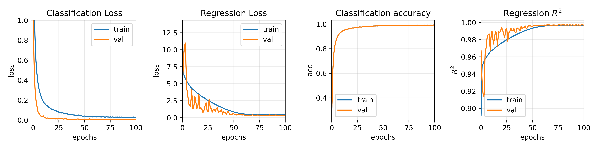
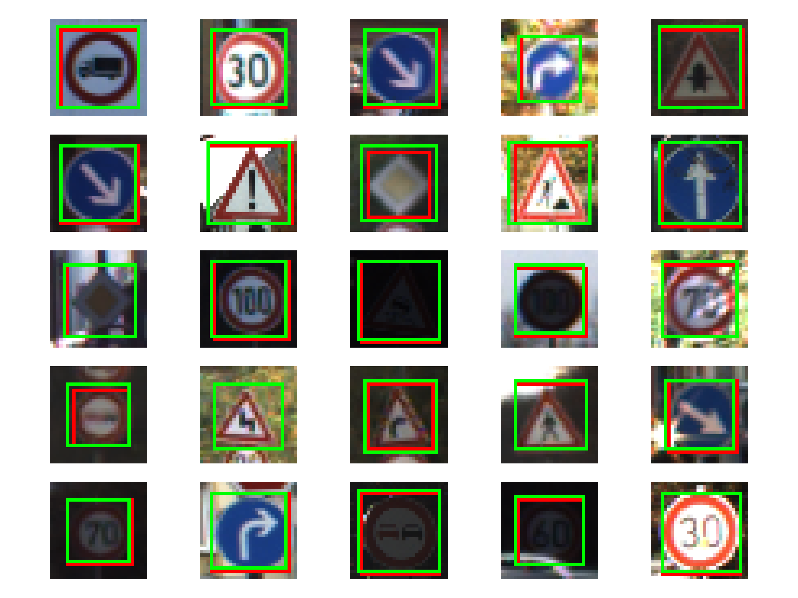

# Overview #
I completed this small project to familiarize myself with Tensorflow and Keras while I was learning about CNNs back in 2019. The goal was to solve the German Traffic Sign Benchmark (GTSB) which is a multi-class, single-image classification challenge held at the International Joint Conference on Neural Networks (IJCNN) 2011. In addition to the classifier network my approach uses a regression model to predict bounding boxes around traffic signs

# Dataset #
The dataset consists of over 50.000 traffic sign images that are distributed over 43 different classes. Image sizes vary from 15x15 to 250x250 pixels and the images are not necessarily square. The dataset provides information about each image's class as well as the bounding box sourrounding each traffic sign. 

# Model #
I use a very simple 3 layer CNN with two max pooling layers. Additionaly the model uses two fully connected layers as outputs, one for classification and one for regression i.e. predicting bounding boxes. For the former I use crossentropy loss and the latter uses MSE as a loss function. The newtork was trained on the training dataset over 100 episodes with a batch size of 32 using the Adam optimizer. The training process is plotted below.

# Evaluation #
After training the model was evaluated on the test GTSB dataset. The results for classification and regression are shown below.
## Classification

|              |  precision    |        recall | f1-score |
| -------------| ------------- | ------------- |------------- |
| accuracy |          -         |       -        |      0.98        |
| macro avg | 0.98  | 0.97  |       0.97       |
| weighted avg | 0.98  | 0.98  |       0.98       |

## Regression
MSE := 0.388 px

 
Red boxes are ground truth and green ones are predictions

# References #
[INI German Traffic Sign Recognition Benchmark](https://benchmark.ini.rub.de/) 
[Dataset on Kaggle](https://www.kaggle.com/meowmeowmeowmeowmeow/gtsrb-german-traffic-sign)

